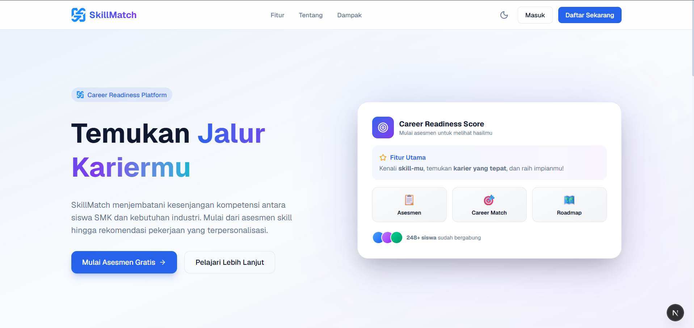
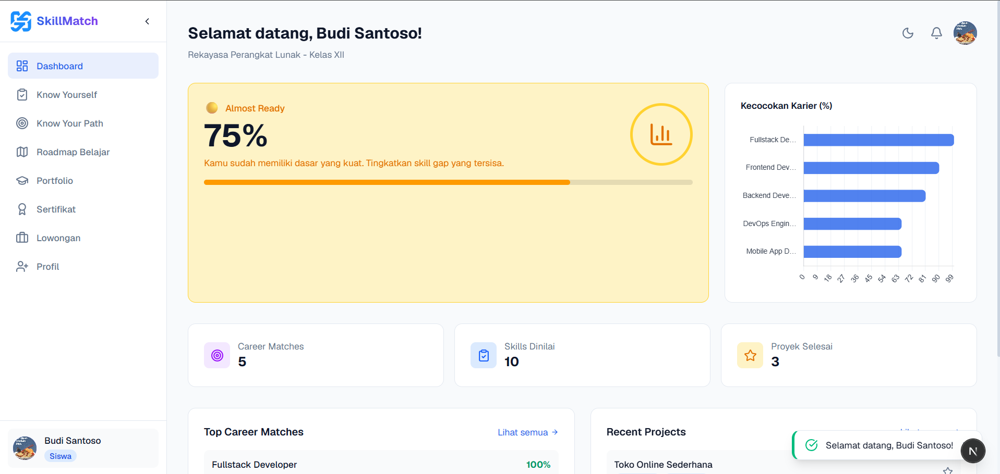
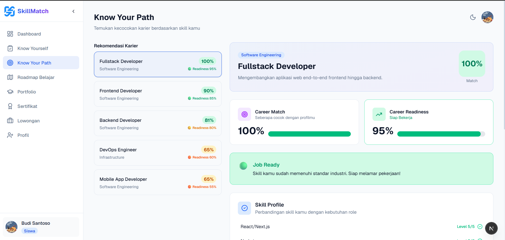
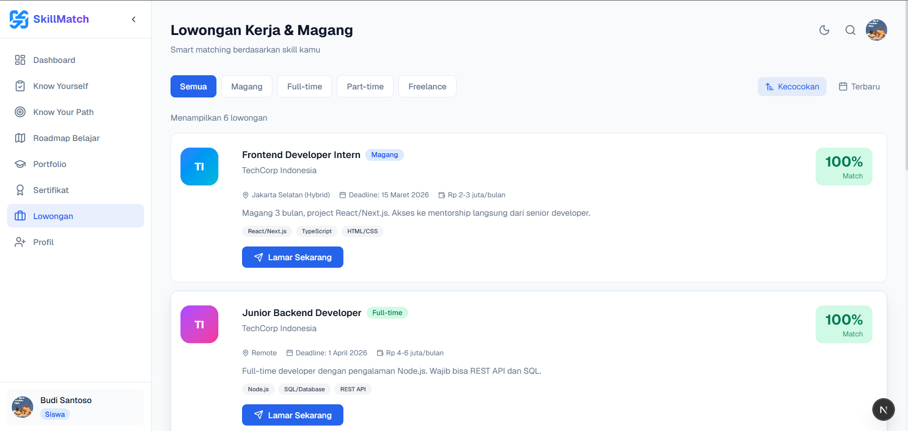
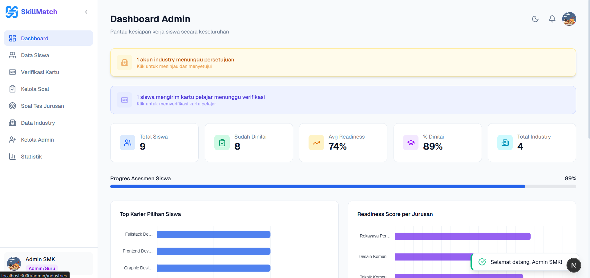
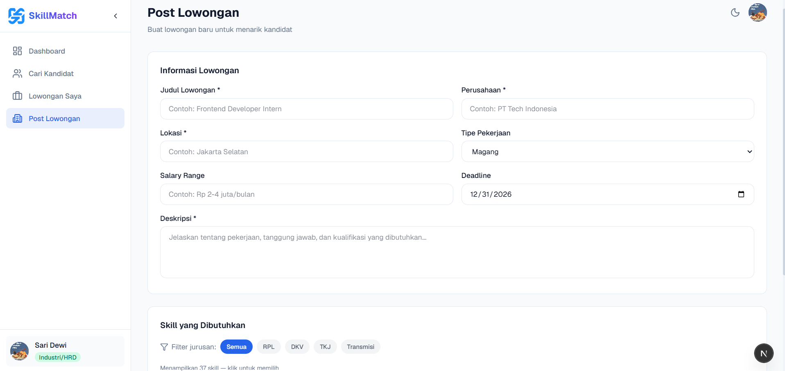
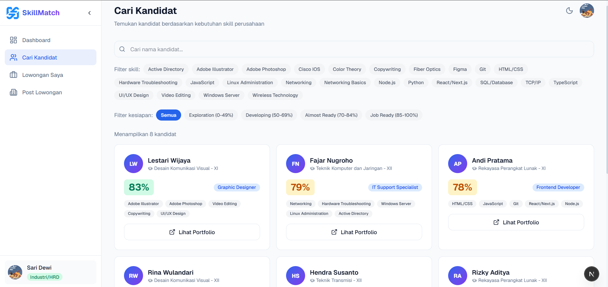

<div align="center">

# SkillMatch
### Career Readiness Platform untuk Siswa SMK

[](https://skillmatch.rexxscode.com)
[](https://api-skillmatch.rexxscode.com)
[](https://api-skillmatch.rexxscode.com/api/docs/)
[](https://github.com/Kalaigram/Skillmatch-API)
[](https://github.com/Kalaigram/Skillmatch-Web-App)
[](https://github.com/Rexxscode/PROYEK-PNJ)
[](LICENSE)

**Submission for ITECHNO CUP 2026 - Web Development**

**By APA AJA ASAL JANGAN ERROR**

</div>

---

## 📋 Daftar Isi

- [Tentang Proyek](#-tentang-proyek)
- [Fitur Unggulan](#-fitur-unggulan)
- [Demo & Screenshot](#-demo--screenshot)
- [Teknologi](#-teknologi)
- [Arsitektur Sistem](#-arsitektur-sistem)
- [Instalasi & Setup](#-instalasi--setup)
- [Penggunaan](#-penggunaan)
- [API Documentation](#-api-documentation)
- [Testing](#-testing)
- [Tim Developer](#-tim-pengembang)
- [Lisensi](#-lisensi)

---

## 👥 Tim Developer

| Nama | Peran | GitHub |
|------|-------|--------|
| **Sofian Bahtiar** | Frontend Developer | [@Sayayyan](https://github.com/Sayayyan) |
| **Muhamad Adzka Lainufar** | Full Stack Developer | [@Rexxscode](https://github.com/Rexxscode) |
| **Fauzan Aji Wibisono** | Backend Developer | [@morganaji17-gif](https://github.com/morganaji17-gif) |

---

## 🎯 Tentang Proyek

### Latar Belakang

Banyak lulusan SMK menghadapi **kesenjangan kompetensi** dengan kebutuhan dunia industri. Siswa sering tidak tahu posisi karier apa yang cocok dengan skill mereka, tidak punya bukti kompetensi yang terdokumentasi, dan kesulitan saat melamar kerja karena tidak adanya portofolio serta hasil pemetaan kemampuan. Di sisi lain, perusahaan kesulitan menyaring kandidat SMK karena tidak ada standar penilaian kemampuan yang terukur.

### Solusi yang Ditawarkan

**SkillMatch** menjawab masalah tersebut melalui satu platform yang menghubungkan alur penuh dari **siswa → sekolah → industri**:

1. **Know Yourself** — Asesmen interaktif yang memetakan kemampuan siswa secara akurat dan terukur.
2. **Know Your Path** — Career matching berbasis skill dengan analisis *gap* untuk menunjukkan karier terbaik.
3. **Build Your Future** — Roadmap belajar personal + pembuatan portofolio otomatis untuk meningkatkan kesiapan kerja.
4. **Get Hired** — *Smart job board* yang mencocokkan skill siswa dengan lowongan magang & kerja dari industri, plus verifikasi kompetensi (sertifikat digital) yang kredibel.

Pendekatan ini unik karena industri **tidak hanya menerima lamaran**, tetapi juga bisa melihat **skor kesiapan (readiness)** dan bukti kompetensi kandidat secara objektif berdasar hasil asesmen.

### Tujuan Proyek

- 🎯 **Tujuan Utama**: Menghubungkan kompetensi siswa SMK dengan peluang karier di industri melalui asesmen terukur, sertifikasi, dan pencocokan kerja.
- 📊 **Target Pengguna**: Siswa SMK (kelas X–XII & alumni), admin sekolah, dan perusahaan/industri.
- 💡 **Value Proposition**: Satu-satunya platform yang mengintegrasikan asesmen skill → gap analysis → roadmap belajar → sertifikat digital → smart job match → verifikasi kartu pelajar, dalam satu alur yang saling terhubung.

---

## ✨ Fitur Unggulan

### Fitur Utama

| Fitur | Deskripsi | Keunggulan |
|----------|--------------|---------------|
| **Asesmen & Tes Jurusan** | Tes 100 soal per jurusan (RPL, DKV, TKJ, Transmisi) membaca di asesmen penempatan siswa, dikelola panel admin terpisah | Menemukenali kesesuaian siswa dengan jurusan secara objektif |
| **Career Matching & Gap Analysis** | Sistem mencocokkan skill siswa dengan profil karier, menampilkan skor kecocokan dan gap skill | Visual Radar Skill (Chart.js) + rekomendasi karier terpersonalisasi |
| **Sertifikat Digital PDF** | Lulus kuis materi → sertifikat dibuat otomatis dan bisa diunduh PDF | Bukti kompetensi resmi berbasis hasil asesmen, tidak cuma klaim di CV |
| **Smart Job Board** | Lowongan dari industri dicocokkan dengan skill siswa (persentase match), tampil salary & filter jenis kerja | Siswa hanya melihat lowongan yang relevan; industri melihat pelamar & kandidat sesuai readiness |
| **Portofolio Publik** | Profil/portofolio siswa dibuat otomatis dari hasil asesmen & bisa diakses publik via link | Siswa siap kerja punya portofolio tanpa perlu membuat dari nol |
| **Verifikasi Kartu Pelajar** | Siswa wajib unggah kartu pelajar yang diverifikasi admin sebelum fitur terbuka | Data & keamanan platform terverifikasi, mencegah akun palsu |

### Fitur Tambahan

- **Statistik Dashboard Admin** - Visualisasi data siswa, jurusan, dan tingkat kesiapan kerja (Chart.js).
- **Kelola Soal Materi** - Admin bisa mengedit/reset soal kuis materi per kurikulum.
- **Roadmap Belajar Personal** - Rencana belajar bertahap sesuai jurusan & gap skill siswa.
- **Notifikasi Real-Time (antar-role)** - Registrasi, persetujuan akun, verifikasi kartu, hingga lamaran pekerjaan saling terhubung antar pengguna.
- **Ubah Password & Grade Override** - Siswa bisa ganti password; admin bisa menyesuaikan kelas siswa.
- **Responsif & Dark Mode** - Tampilan mobile-friendly (teruji hingga 375px) dengan dukungan mode terang/gelap.

---

## 📸 Demo & Screenshot

### Live Demo

| Platform | Link |
|---|---|
| 🌐 Website | https://skillmatch.rexxscode.com |
| ⚙️ API | https://api-skillmatch.rexxscode.com |
| 📖 Swagger API Docs | https://api-skillmatch.rexxscode.com/api/docs/ |

### Screenshot Aplikasi

<div align="center">
  
  <p><em>Homepage - Tampilan utama aplikasi</em></p>

  
  <p><em>Dashboard - Panel kontrol pengguna</em></p>

  
  <p><em>Know Your Path - Rekomendasi karier & skill gap</em></p>

  
  <p><em>Smart Job Board - Lowongan yang cocok dengan skill siswa</em></p>

  
  <p><em>Admin - Panel data siswa & verifikasi kartu pelajar</em></p>

  
  <p><em>Industry - Membuat lowongan kerja</em></p>

  
  <p><em>Industry - Melihat kandidat beserta readiness score</em></p>
</div>

### Video Demo

📹 **[Link Video Demo](https://[URL_VIDEO])** _(opsional)_

---

## 🛠️ Teknologi

### Tech Stack

#### Frontend
```
Framework    : Next.js 16 (App Router) + React 19
UI Library   : Tailwind CSS v4 + lucide-react
State Mgmt   : React Context API & Custom Hooks (Toast, Theme, Auth)
Chart & PDF  : Chart.js / react-chartjs-2, jsPDF, modern-screenshot
Validation   : TypeScript strict (+ validasi manual pada form)
```

#### Backend
```
Runtime      : PHP 8.2+
Framework    : Laravel 13 (REST API)
Database     : SQLite (default) / MySQL
ORM          : Eloquent
Auth         : Session / JWT (rencana) + verifikasi berlapis admin
```

#### DevOps & Tools
```
Deployment   : Tencent Cloud (CVM / COS / CDN)
CI/CD        : GitHub Actions
Testing      : puppeteer-core (E2E, 28 kasus) + ESLint 9 + TypeScript
Monitoring   : [Sentry / LogRocket / dll]
```

### Alasan Pemilihan Teknologi

| Teknologi | Alasan Pemilihan |
|-----------|------------------|
| **Next.js + React** | App Router, TypeScript first-class, dan SSR/CSR hybrid yang cepat; ekosistem besar untuk pengembangan cepat. |
| **Tailwind CSS v4** | Utility-first mempercepat styling, konsisten, dan mudah responsif tanpa file CSS manual.                     |
| **Chart.js** | Ringan dan kaya untuk visualisasi radar skill, distribusi siswa, dan statistik kesiapan kerja.                      |
| **jsPDF + modern-screenshot** | Generate sertifikat digital dalam PDF langsung di browser tanpa backend eksternal.                 |
| **Laravel** | Backend REST API yang matang, aman, produktif, dan banyak dipelajari di sekolah (RPL).                               |
| **puppeteer-core (E2E)** | Simulasi pengguna nyata lintas role (siswa, admin, industry) untuk menjamin semua fitur terhubung.      |

### Dependencies Utama

```json
{
  "dependencies": {
    "next": "16.3.1",
    "react": "19.2.8",
    "react-dom": "19.2.8",
    "chart.js": "^4.5.1",
    "react-chartjs-2": "^5.3.1",
    "jspdf": "^4.2.1",
    "modern-screenshot": "^4.7.0",
    "lucide-react": "^1.31.0",
    "clsx": "^2.1.1",
    "tailwind-merge": "^3.6.0"
  },
  "devDependencies": {
    "typescript": "^5",
    "tailwindcss": "^4",
    "eslint": "^9",
    "puppeteer-core": "^25.9.0"
  }
}
```

---

## 🏗️ Arsitektur Sistem

### System Architecture

```
┌──────────────────────────  CLIENT (Next.js 16)  ──────────────────────────┐
│                                                                           │
│  Landing → Auth (Login/Register/Pending)                                  │
│  ┌───────────┐  ┌───────────┐  ┌───────────┐  ┌───────────┐               │
│  │  SISWA    │  │  INDUSTRY │  │   ADMIN   │  │  PUBLIC   │               │
│  │ Dashboard │  │ Dashboard │  │ Dashboard │  │ Portfolio │               │
│  │ Career    │  │ Post Job  │  │ Data      │  │ /portfolio│               │
│  │ Match     │  │ My Jobs   │  │ Siswa     │  │ /:slug    │               │
│  │ Asesmen   │  │ Kandidat  │  │ Kartu     │  └───────────┘               │
│  │ Sertifikat│  └───────────┘  │ Soal      │                              │
│  │ Jobs      │                 │ Statistik │                              │
│  │ Portfolio │                 └───────────┘                              │
│  │ Profile   │                                                            │
│  └───────────┘                                                            │
│                                                                           │
│   app/lib (data layer): mock-data · career-match · materi-quiz ·          │
│     certificates · notifications · job-skills · api-contract              │
└──────────────────────────┬────────────────────────────────────────────────┘
                           │ NEXT_PUBLIC_API_URL
                  ┌────────▼────────┐
                  │  Laravel REST   │    ┌────────────┐
                  │  API (/api/v1)  │──▶| PostgreSQL │
                  └─────────────────┘    │ / MySQL    │
                                         └────────────┘
```

> **Status integrasi:** Frontend berjalan penuh di atas lapisan data `app/lib` (mock/localStorage). Kontrak API backend sudah didefinisikan di `app/lib/api-contract.ts` dan siap diimplementasikan oleh tim Backend (Laravel).

### Database Schema (Target)

```
users             -> id, name, email, password, role(student|industry|admin), status(pending|approved|rejected)
students          -> user_id, major, grade, card_status, grade_override
majors            -> id, code(rpl|dkv|tkj|transmisi), name
materi            -> id, major_id, title, description
questions         -> id, materi_id/major_id, question, options, answer
quiz_results      -> id, student_id, materi_id, score, passed, taken_at
certificates      -> id, student_id, materi_id, issued_at
career_matches    -> id, student_id, position, match_score, required_skills
jobs              -> id, industry_id, title, type, location, salary, deadline, skills
applications      -> id, job_id, student_id, applied_at
portfolios        -> id, student_id, project_title, description, link
notifications     -> id, user_id, type, text, read_at
```

### Folder Structure

```
PROYEK-PNJ/
├── frontend/                     # Next.js 16
│   ├── app/
│   │   ├── page.tsx              # Landing page
│   │   ├── auth/                 # login · register · pending
│   │   ├── student/              # dashboard · jobs · career-match · assessment
│   │   │                         # roadmap · sertifikat[/materiId] · portofolio · profile
│   │   ├── industry/             # dashboard · post-job · my-jobs · candidates
│   │   ├── admin/                # dashboard · students · industries · accounts
│   │   │                         # card-verification · statistics · quiz[/major]
│   │   ├── portfolio/[slug]      # portofolio publik
│   │   ├── components/           # layout/ · ui/ · charts/ · certificate/
│   │   └── lib/                  # mock-data · career-match · materi-quiz*
│   │                             # certificates · notifications · job-skills · api-contract
│   ├── public/                   # Static assets (logo, favicon)
│   └── e2e (repo dev)            # pengujian end-to-end puppeteer-core
├── backend/                      # Laravel 13 (REST API)
│   ├── app/Http/                 # Controllers, Middleware
│   ├── routes/                   # api.php (dengan endpoint /api/v1)
│   └── database/                 # migrations, seeders
└── README.md
```

---

## ⚙️ Instalasi & Setup

### Prerequisites

Pastikan Anda telah menginstall:
- **Node.js** (v18.x atau lebih tinggi)
- **npm**
- **PHP** (v8.2+)
- **Composer**
- **Git**

### Langkah Instalasi

#### 1️ Clone Repository

```bash
git clone https://github.com/Rexxscode/PROYEK-PNJ.git
cd [repo-name]
```

#### 2️ Frontend (Next.js)

```bash
cd frontend
npm install
npm run dev
```

Aplikasi berjalan di `http://localhost:3000`

#### 3️ Backend (Laravel)

```bash
cd backend
composer install
copy .env.example .env          # Windows
php artisan key:generate
php artisan migrate --seed
php artisan serve               # Server berjalan di http://localhost:8000
```

#### 4️ Setup Environment Variables

Buat file `.env.local` di folder `frontend`:

```env
# URL API backend
NEXT_PUBLIC_API_URL=http://127.0.0.1:8000/
```

---

## 🚀 Penggunaan

### Menjalankan Aplikasi

```bash
# Development mode (frontend)
cd frontend && npm run dev

# Production build
cd frontend && npm run build && npm start

# Linting
cd frontend && npm run lint
```

### Akun Demo

| Role  | Email | Password |
|------ |-------|----------|
| Siswa | `budi@student.smk.id` | `Budi@2026!` |
| Admin | `admin@smk.id` | `Admin@2026!` |
| Industry | `hrd@techcorp.com` | `TechCorp@2026!` |

### User Guide

#### Untuk Siswa / SMK

1. **Registrasi** di `/auth/register`, lalu tunggu persetujuan admin (status di halaman *Pending*).
2. **Login** setelah disetujui, lalu unggah **kartu pelajar** di halaman Profil agar fitur terbuka setelah diverifikasi admin.
3. Mulai dari **Tes Jurusan & Asesmen skill** di *Career Match*, kerjakan kuis materi di *Sertifikat*, unduh sertifikat PDF saat lulus.
4. Ikuti **Roadmap** belajar, perbarui **Portofolio**, dan **Lamar Lowongan** yang sudah dicocokkan dengan skillmu di halaman *Jobs*.

#### Untuk Industry / Perusahaan

1. Registrasi akun perusahaan → disetujui admin.
2. **Post Lowongan** di halaman *Post Job* (silakan pilih skill sesuai jurusan), terima lamaran & lihat pelamar di *My Jobs*.
3. Jelajahi **Kandidat** lengkap dengan *readiness score* & link portofolio publik.

#### Untuk Admin

1. Akses panel di `/admin` (role admin).
2. **Data Siswa** — setujui/tolak akun baru, verifikasi kartu pelajar, ubah kelas (grade override).
3. **Data Industry / Accounts** — kelola akun perusahaan & admin.
4. **Kelola Soal** (kuis materi & Tes Jurusan) dan lihat **Statistik** kesiapan kerja siswa.

---

## 📚 API Documentation

### Base URL

```
Development: http://127.0.0.1:8000/api/v1            (Laravel local)
Production:  https://api-skillmatch.rexxscode.com/api/v1   (API production)
Web App:     https://skillmatch.rexxscode.com
Swagger UI:  https://api-skillmatch.rexxscode.com/api/docs/
```

### Endpoints (sinkron dengan Dokumentasi Swagger)

Seluruh endpoint diawali `/api`. Contoh lengkap & skema request/response ada di **[Swagger UI](https://api-skillmatch.rexxscode.com/api/docs/)** atau `backend/docs/openapi.yaml`.

#### Autentikasi

```http
POST   /api/v1/auth/login                         # Login pengguna
POST   /api/v1/auth/register                      # Registrasi pengguna baru (student/industry)
POST   /api/v1/auth/logout                        # Keluar sesi (revoke token)
GET    /api/v1/auth/me                            # Profil pengguna saat ini
POST   /api/v1/auth/change-password               # Ubah kata sandi
POST   /api/v1/auth/forgot-password               # Lupa kata sandi
POST   /api/v1/auth/reset-password                # Atur ulang kata sandi
```

#### Jurusan (Majors)

```http
GET    /api/v1/majors                             # Daftar jurusan (admin)
GET    /api/v1/majors/{major}/materi              # Mata pelajaran per jurusan (admin)
```

#### Asesmen

```http
GET    /api/v1/assessment/questions/{major?}      # Daftar soal asesmen (filter jurusan opsional)
GET    /api/v1/assessment/questions/admin/{major?}# Soal asesmen versi admin (dengan kunci jawaban)
POST   /api/v1/assessment/submit                  # Kirim jawaban asesmen (student)
GET    /api/v1/assessment/results                 # Hasil asesmen pengguna (student)
PUT    /api/v1/assessment/questions               # Perbarui soal asesmen (admin)
POST   /api/v1/assessment/questions/reset         # Reset soal asesmen (admin)
```

#### Materi

```http
GET    /api/v1/materi/majors/{major}              # Daftar materi per jurusan
GET    /api/v1/materi/{materiId}/questions        # Soal quiz per materi (student)
POST   /api/v1/materi/{materiId}/submit           # Kirim jawaban quiz materi (student)
GET    /api/v1/materi/{materiId}/questions/admin  # Soal materi versi admin
PUT    /api/v1/materi/{materiId}/questions        # Perbarui soal materi (admin)
POST   /api/v1/materi/{materiId}/questions/reset  # Reset soal materi (admin)
```

#### Sertifikat

```http
GET    /api/v1/certificates                       # Daftar sertifikat siswa (student)
GET    /api/v1/certificates/{materiId}            # Detail sertifikat per materi (student)
```

#### Roadmap

```http
GET    /api/v1/roadmap                            # Roadmap kesiapan kerja (student)
GET    /api/v1/roadmap/progress                   # Progres milestone (student)
POST   /api/v1/roadmap/progress                   # Perbarui progres milestone (student)
```

#### Portofolio

```http
GET    /api/v1/portfolios/{email}/projects        # Proyek siswa (student)
POST   /api/v1/portfolios                         # Simpan proyek portofolio (student)
GET    /api/v1/portfolios/public/{slug}           # Portofolio publik
```

#### Industri

```http
GET    /api/v1/industries/me                      # Profil perusahaan (industry)
GET    /api/v1/industries/profile                 # Profil perusahaan (industry)
PUT    /api/v1/industries/profile                 # Perbarui profil perusahaan (industry)
PATCH  /api/v1/industries/profile                 # Perbarui profil parsial (industry)
GET    /api/v1/industries/candidates              # Daftar kandidat siswa (industry)
```

#### Lowongan Kerja

```http
GET    /api/v1/jobs                               # Daftar lowongan (publik)
GET    /api/v1/jobs/mine                          # Lowongan milik perusahaan (industry)
GET    /api/v1/jobs/{id}                          # Detail lowongan
POST   /api/v1/jobs                               # Buat lowongan kerja (industry)
PUT    /api/v1/jobs/{id}                          # Perbarui lowongan (industry)
DELETE /api/v1/jobs/{id}                          # Hapus lowongan (industry)
POST   /api/v1/jobs/{id}/apply                    # Lamar sebuah lowongan (student)
GET    /api/v1/jobs/applications/mine             # Lamaran saya (student)
GET    /api/v1/jobs/{id}/applications             # Daftar pelamar lowongan (industry)
PUT    /api/v1/jobs/{id}/applications/{applicationId}/status  # Perbarui status lamaran (industry)
```

#### Notifikasi

```http
GET    /api/v1/notifications                      # Daftar notifikasi
POST   /api/v1/notifications                      # Buat notifikasi
GET    /api/v1/notifications/unread-count         # Jumlah notifikasi belum dibaca
POST   /api/v1/notifications/{id}/read            # Tandai notifikasi sudah dibaca
POST   /api/v1/notifications/read-all             # Tandai semua notifikasi sudah dibaca
```

#### Admin

```http
GET    /api/v1/admins                             # Daftar admin (admin)
POST   /api/v1/admins                             # Buat akun admin (admin)
GET    /api/v1/industries                         # Daftar perusahaan untuk dikelola (admin)
POST   /api/v1/industries/{email}/approval        # Setujui/tolak perusahaan (admin)
```

#### Registrasi Kartu

```http
GET    /api/v1/registrations/students             # Daftar siswa untuk verifikasi kartu (admin)
POST   /api/v1/registrations/students/{email}/approve  # Setujui kartu siswa (admin)
POST   /api/v1/registrations/students/{email}/reject   # Tolak kartu siswa (admin)
POST   /api/v1/registrations/students/card        # Unggah kartu pelajar (student)
```

#### Manajemen Siswa

```http
GET    /api/v1/students                           # Daftar siswa (paginasi + pencarian)
GET    /api/v1/students/{slug}                    # Detail siswa
PUT    /api/v1/students/{email}/grade             # Perbarui tingkat/kelas siswa (admin)
POST   /api/v1/students/avatar                    # Unggah avatar siswa (student)
```

#### Statistik

```http
GET    /api/v1/admin/statistics                   # Statistik dashboard (admin)
GET    /api/v1/admin/statistics/readiness         # Distribusi kesiapan kerja (admin)
```

### Example Request

```javascript
// Login
const response = await fetch('/api/v1/auth/login', {
  method: 'POST',
  headers: { 'Content-Type': 'application/json' },
  body: JSON.stringify({
    email: 'hrd@techcorp.com',
    password: 'TechCorp@2026!'
  })
});
```

📖 **[Swagger API Docs](https://api-skillmatch.rexxscode.com/api/docs/)** · **[Spesifikasi OpenAPI](./backend/docs/openapi.yaml)** · **[routes/api.php](./backend/routes/api.php)**

> **Catatan:** Daftar endpoint di atas terambil dari dokumentasi **Swagger** resmi (`backend/docs/openapi.yaml`) dan sinkron dengan implementasi `backend/routes/api.php`.

---

## 🧪 Testing

### Running Tests

```bash
# Cek tipe & lint (frontend)
cd frontend
npx tsc --noEmit
npm run lint

# Build produksi
npm run build

# E2E (28 skenario lintas role: siswa, admin, industry)
$env:NODE_PATH="D:\...\frontend\node_modules"; node e2e.js
```

### Cakupan E2E

```
Autentikasi & role guard     : A1, I1, J1-J3
Sertifikat & kuis materi     : B4, C1, D1, E1, K1, L1, M1-M2
Lowongan siswa               : F1a, F1b
Industry (post job, apply)   : G1, [lamaran & pelamar]
Admin (data, kartu, soal)    : H2, J4-J5, O1, P1, V1
Tes Jurusan & respondif      : R1, Q1
```

```
```

---

## 📄 Lisensi

Proyek ini dilisensikan di bawah [MIT License](LICENSE) - lihat file LICENSE untuk detail lebih lanjut.

---

<div align="center">

**Made with ❤️ by APA AJA ASAL JANGAN ERROR for ITECHNO CUP 2026**

</div>